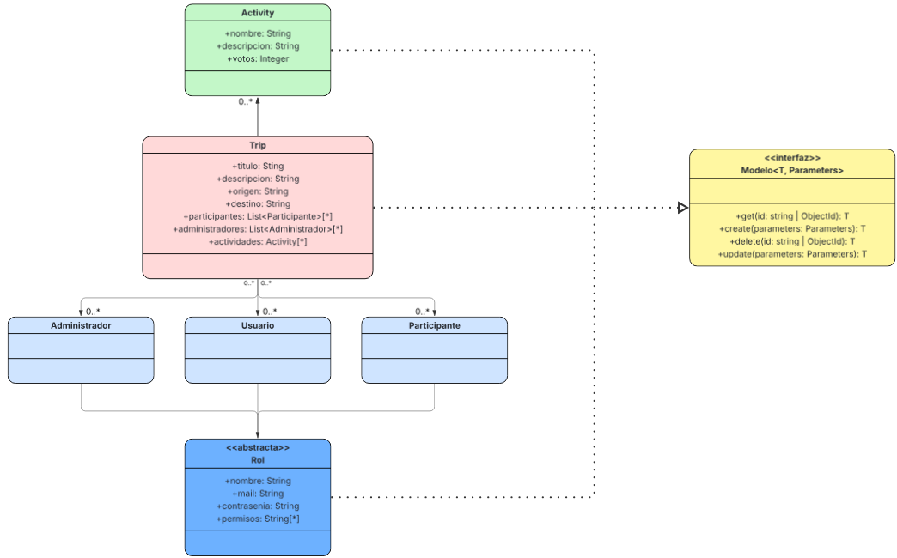

# TripMate  
***Pagina para organizar viajes colaborativos***
### Integrantes
Karim Velez - karimveleza@gmail.com
Franco Baudrix - 
Jesica Pellegrini - jesicapellegrini@gmail.com
Federico Ruppel - federupel@gmail.com
---

### Descripcion de entidades

**Rol**
Va ser la clase abstracta que vamos a usar para que hereden los 3 tipos de usuarios. Los tipos de usuario van a representar a 
los distintos usuarios de la pagina. Con estas entidades vamos a poder conectar a distintas personas en el sitio y darles las 
herramientas para crear y organizar sus viajes, para unirse a otros viajes, etc.

**Administrador --> Hereda de Rol**
Va a ser el usuario creador de un viaje y va a podes manipular a la entidad trip de distintas maneras

**Participante --> Hereda de Rol**
Va a ser un usuario que forme parte de un trip pero que no sea administrador de este. Tiene menos permisos que el administrador

**Usuario --> Hereda de Rol**
Representa cuando el usuario no esta adentro de un trip y simplementa esta interactuando con la pagina de inicio.

**Trip**
Trip va a ser la entidad que representa el viaje que planea un usuario. Otros usuarios podran unirse a este viaje. La entidad viaje va a tener los atributos suficientes para ser lo mas descriptivo posible, asi los usuarios pueden decidir con certeza si quieren participar de este viaje o no. 

**Activity** 
Activity es una entidad que representa una actividad dentro de un viaje. Si Pepito crea un viaje a Irak luego Pepito, o cualquier usuario que se haya unido al viaje, puede crear una actividad que se llame "Jugar al futbol" por ejemplo y esta actividad se va a agregar al viaje. Asi los otros usuarios pueden saber de que se va a tratar este viaje y que cosas van a hacer.

### Planeacion

**Esquema**
Como el DBML fue hecho para usarse con bases de datos relacionales y nosotros vamos a usar MongoDB (no relacional) entonces vamos a usar el Mongoose Schema para representar las entidades en vez de DBML.

```js
const Usuario = new Schema({
    nombre: { type: String, required: true },
    mail: { type: String, required: true, unique: true },
    contrasena: { type: String, required: true },
    permisos: ["crearTrip"] 
});
```

```js
const Participante = new Schema({
    nombre: { type: String, required: true },
    mail: { type: String, required: true, unique: true },
    contrasena: { type: String, required: true },
    permisos: 
        [
            {
                type: String,
                default: ["crearActividad", "votar"]
            }
        ] 
});
```

 ```js
const Administrador = new Schema({
    nombre: { type: String, required: true },
    mail: { type: String, required: true, unique: true },
    contrasena: { type: String, required: true },
    permisos: 
        [
            { 
                type: String 
                default: ["eliminarParticipante", "agregarParticipante", "crearActividad", "borarActividad", "borrarTrip", "votar"]
            }
        ] 
});
 ```

```js
const Activity = new Schema({
    nombre: {type: String, required: true},
    descripcion: {type: String, required: true},
    votos: {type: Number, min: 0}
})
```

```js
const Trip = new Schema({
    titulo: {type: String, required: true},
    descripcion: {type: String, required: true},
    origen: {type: String, required: true},
    destino: {type: String, required: true},
    participantes: 
        [
            {
                type: Schema.Types.ObjectId, 
                ref: "Participante",
                default: ["Sin participantes"]
            }
        ],
    administradores: 
        [
            {
                type: Schema.Types.ObjectId,
                ref: "Administrador",
                required: true
            }
        ]
    actividades: 
        [
            {
                type: Schema.Types.ObjectId,
                ref: "Activity",
                default: ["Sin actividades planeadas"]
            }
        ]
})
```

**Diagrama de entidades**



**Diseno del front**

